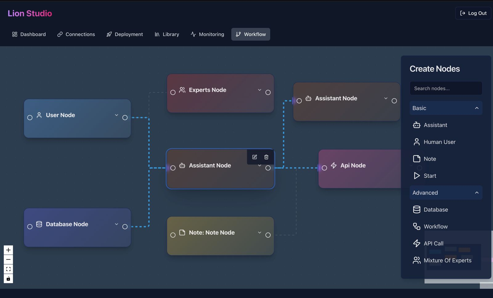

# Welcome to Lion Studio

## Project info

**Project**: Lion Studio

**URL**: https://github.com/lion-agi/lion-studio





## How can I edit this code?

There are several ways of editing your application.


**Use GPT Engineer**

Simply visit the GPT Engineer project at [GPT Engineer](https://gptengineer.app) and start prompting.

Changes made via gptengineer.app will be committed automatically to this repo.

**Use your preferred IDE**

If you want to work locally using your own IDE, you can clone this repo and push changes. Pushed changes will also be reflected in the GPT Engineer UI.

The only requirement is having Node.js & npm installed - [install with nvm](https://github.com/nvm-sh/nvm#installing-and-updating)

Follow these steps:

```sh
git clone https://github.com/lion-agi/lion-studio.git
cd lion-studio
npm i

# This will run a dev server with auto reloading and an instant preview.
npm run dev
```

**Edit a file directly in GitHub**

- Navigate to the desired file(s).
- Click the "Edit" button (pencil icon) at the top right of the file view.
- Make your changes and commit the changes.

**Use GitHub Codespaces**

- Navigate to the main page of your repository.
- Click on the "Code" button (green button) near the top right.
- Select the "Codespaces" tab.
- Click on "New codespace" to launch a new Codespace environment.
- Edit files directly within the Codespace and commit and push your changes once you're done.

## What technologies are used for this project?

This project is built with:

- Vite
- React
- shadcn-ui
- Tailwind CSS
- Supabase (for backend and authentication)
- React Flow (for workflow editor)

## How can I deploy this project?

All GPT Engineer projects can be deployed directly via the GPT Engineer app.

Simply visit your project at [GPT Engineer](https://gptengineer.app) and click on Share -> Publish.

## I want to use a custom domain - is that possible?

We don't support custom domains (yet). If you want to deploy your project under your own domain then we recommend using Netlify or GitHub pages. Visit our docs for more details: [Custom domains](https://docs.gptengineer.app/tips-tricks/custom-domain/)

## Features

Lion Studio offers the following key features:

- Intelligent Workflow Automation
- AI-Powered Workflow Editor
- User Authentication and Profile Management
- Image Upload and Gallery
- Customizable Node Types for Workflows

## Getting Started

To get started with Lion Studio:

1. Clone the repository
2. Install dependencies with `npm install`
3. Set up your Supabase project and update the environment variables
4. Run the development server with `npm run dev`

For more detailed instructions, please refer to our documentation.

## Contributing

We welcome contributions to Lion Studio! Please read our contributing guidelines before submitting pull requests.

## License

[Your chosen license]

## Contact

For any queries or support, please contact [Your contact information].
